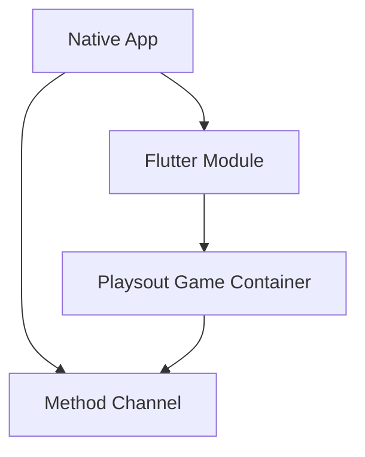

```markdown
# Playsout SDK Integration Guide

 <!-- Add actual image path -->

## 1. Overview

Playsout Mini Game Container SDK is developed using **Flutter + C++** at the underlying layer, combining rapid cross-platform capabilities with high performance. This document guides you through integrating Playsout Mini Game Container into your existing native Android/iOS projects.

## 2. Technical Requirements
If you wish to incorporate Playsout Mini-Game Container capabilities into your existing App, we recommend adopting a hybrid development approach by embedding the Flutter module into your native App project.
This significantly reduces workload and enables rapid implementation of Playsout Mini-Game Container functionality in both Android and iOS native Apps.


### Environment Requirements

| Environment | Version Requirements |
|-------------|----------------------|
| **Android** | <ul><li>Android Studio 3.5+</li><li>Android 5.0+ devices (API 21+)</li></ul> |
| **iOS** | <ul><li>Xcode 11.0+</li><li>Valid developer signature</li></ul> |
| **Build System** | Gradle 4.2.1+ |

## 3. Native Platform Implementation

### 1) Flutter Hybrid Development Principle


Key components:
- **Flutter Module**: Reusable game container
- **Native Host**: 
  - Android: `FlutterActivity`
  - iOS: `FlutterViewController`
- **Communication**: Method Channel for data exchange

### 2) Adding to Android Project
Playsout SDK provides Android Archive (AAR) for integration:

1. Add dependency in `app/build.gradle`:
```gradle
dependencies {
    implementation 'com.playsout:sdk:latest_version'
}
```

2. Configure in `AndroidManifest.xml`:
```xml
<activity
    android:name="io.flutter.embedding.android.FlutterActivity"
    android:theme="@style/AppTheme" />
```

[Full Android Integration Guide](https://docs.flutter.dev/add-to-app/android)

### 3) Adding to iOS Project
Playsout SDK provides Xcode frameworks:

1. Add to Podfile:
```ruby
pod 'PlaysoutSDK', '~> latest_version'
```

2. Initialize in AppDelegate:
```swift
let flutterEngine = FlutterEngine(name: "playsout_engine")
```

[Full iOS Integration Guide](https://docs.flutter.dev/add-to-app/ios)

## 4. Integration Steps (Android Example)

### 1) Environment Preparation
- ✅ Android 5.0+ device
- ✅ Gradle 4.2.1+
- ✅ Android Studio 3.5+

### 2) Service Activation
1. Contact Playsout business team for control platform access
2. Obtain your unique credentials:
   - `SDKAppID`
   - `SDKSecretKey`

 <!-- Add actual image path -->

### 3) SDK Configuration
1. Download SDK:  
   [playsout-sdk-android](https://github.com/Playsout/Playsout_sdk_android)

2. Configure repositories in `settings.gradle.kts`:
```kotlin
dependencyResolutionManagement {
    repositories {
        maven {
            url = uri("https://github.com/Playsout/Playsout_sdk_android/raw/main/releases")
        }
    }
}
```

3. Add dependency in `app/build.gradle.kts`:
```kotlin
dependencies {
    implementation("com.playsout:sdk:latest_version")
}
```

4. Update `AndroidManifest.xml` (reference demo implementation)

### 4) SDK Initialization
Initialize in your Application class:
```java
public class MyApp extends Application {
    @Override
    public void onCreate() {
        super.onCreate();
        
        PlaysoutSdkConfig config = new PlaysoutSdkConfig.Builder()
            .appId("YOUR_SDK_APP_ID")    // From service activation
            .secretKey("YOUR_SECRET_KEY") 
            .build();
            
        PlaysoutSdk.initialize(this, config);
    }
}
```

### 5) Launch Mini Game Container
Start the game container from any Activity:
```java
private void launchFlutterActivity() {
    try {
        Intent intent = FlutterActivity
            .withCachedEngine(CacheId.PLAYSOUT_ENGINE_ID)
            .build(MainActivity.this);
        startActivity(intent);
    } catch (Exception e) {
        // Handle launch errors
        Log.e("Playsout", "Launch failed", e);
    }
}
```

## 5. iOS Implementation (Similar Flow)

```swift
func launchGameContainer() {
    let engine = FlutterEngine(name: "playsout_engine")
    engine.run()
    
    let gameVC = FlutterViewController(engine: engine, nibName: nil, bundle: nil)
    present(gameVC, animated: true)
}
```

## 6. Next Steps
- [Explore Sample Games](https://github.com/Playsout/sample-games)
- [API Reference](https://docs.playsout.dev/api)
- [Troubleshooting Guide](https://docs.playsout.dev/troubleshooting)

## Support Resources
- GitHub Repository: [playsout-sdk-android](https://github.com/Playsout/Playsout_sdk_android)
- Issue Tracker: [Report Issues](https://github.com/Playsout/Playsout_sdk_android/issues)
- Business Inquiries: partners@playsout.com

 <!-- Add actual image path -->
```

> **Note**: Replace `path/to/...` placeholders with actual image paths from your documentation. For GitHub README, you can:
> 1. Add images to your repository's `/docs/images/` folder
> 2. Use absolute paths like:  
>    `https://github.com/Playsout/Playsout_sdk_android/raw/main/docs/images/sdk-architecture.png`
